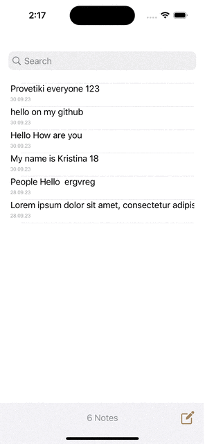

# Notes

The application has the ability to add, edit, delete notes. They are sorted by time added.It is possible to search by notes. All notes are saved using Core data. MVP architecture is used.

